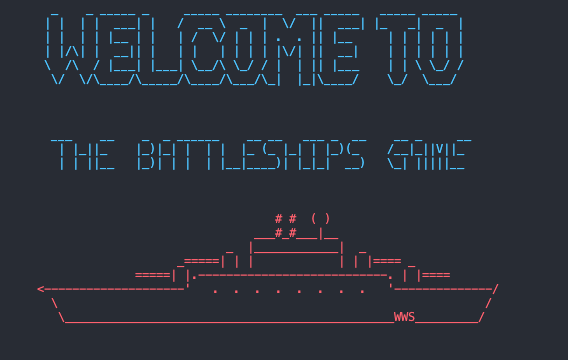
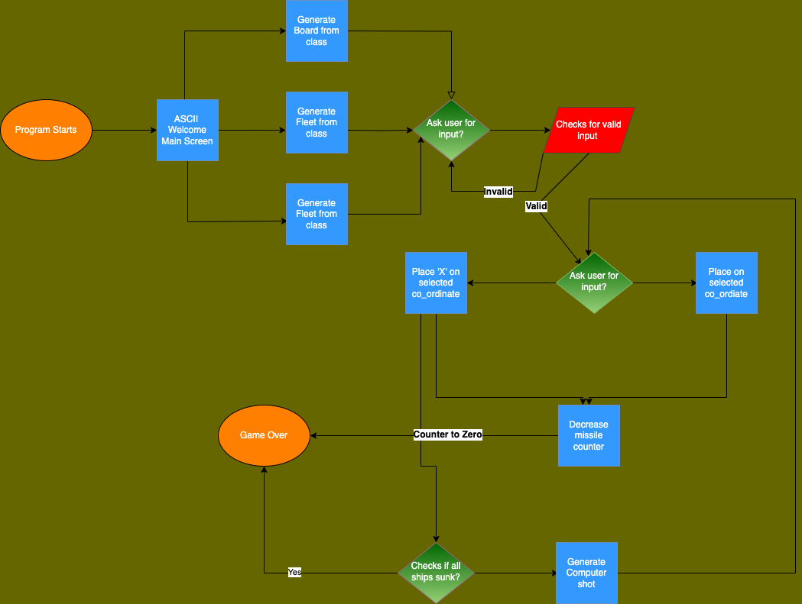
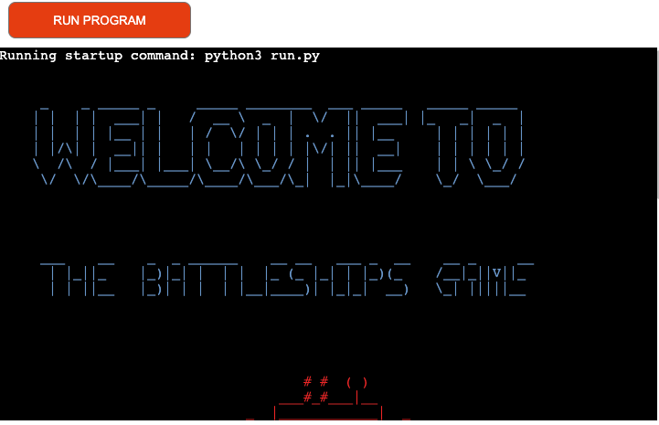
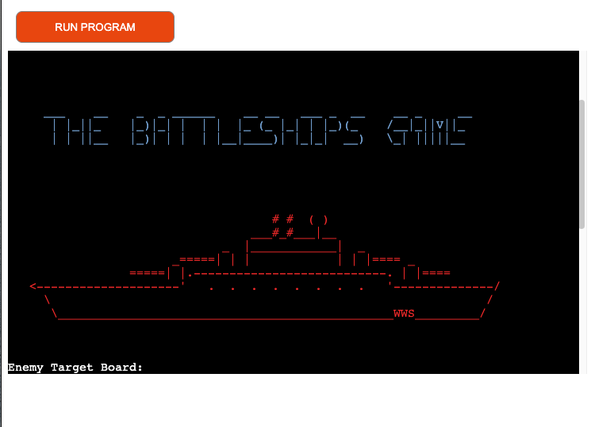
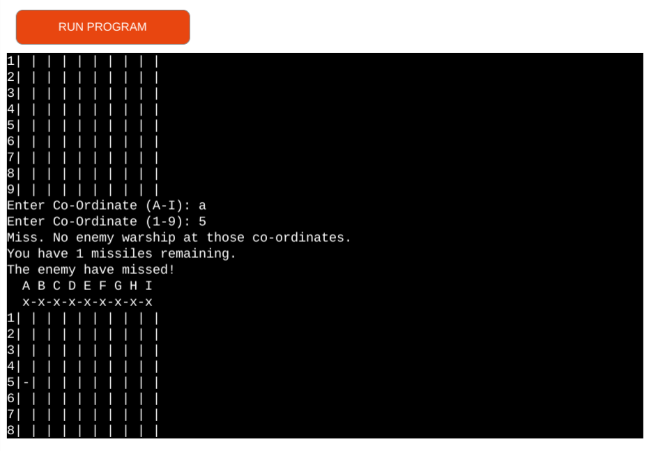
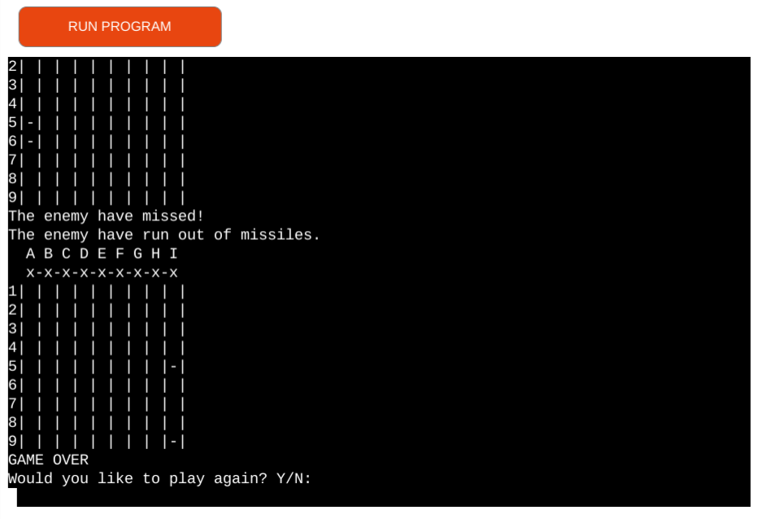
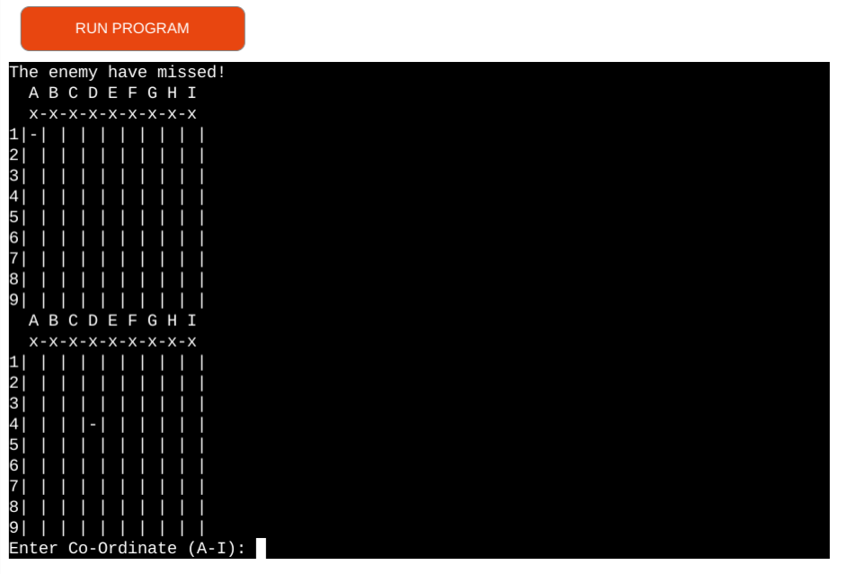
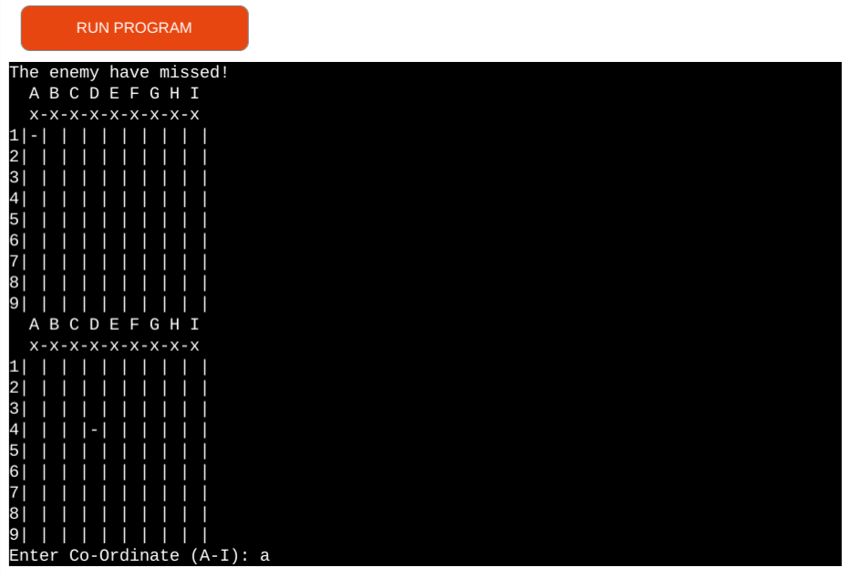
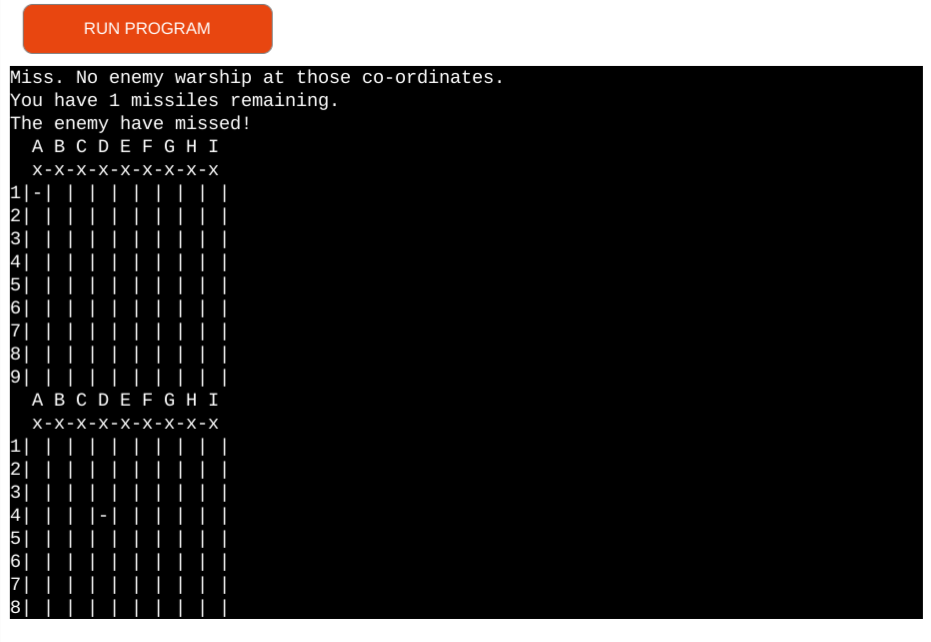

# Battleships

Battleships is a game of logic, with players attempting to sink each others fleet by guessing co-ordinates.
This version uses a a board generated using Python lists and incorporates a logic engine to allow the computer to fire back at the user.

[The live link can be found here](https://pp3-battleships-cae1b33910a6.herokuapp.com/)
## Table of Content

- [Project Goals](#project-goals)
    . [User Goals](#user-goals)
    . [Site Owner Goals](#site-owner-goals)
- [User Experience](#user-experience)
    . [Target Audience](#target-audience)
    . [User Requirements and Expectations](#user-requirements-and-expectations)
    . [User Stories](#user-stories)
- [Battlefleet Game Instructions](#battlefleet-game-instructions)    
- [Libraries and Technologies Used](#libraries-and-technologies-used)
    . [Flowchart](#flowchart)
- [Technologies Used](#technologies-used)
    . [Languages](#languages)
    . [Frameworks & Tools](#frameworks-&-tools)
- [Features](#features)
- [Testing](#validation)
    . [PEP8 validation](#pep8-validation)
    . [Testing user stories](#testing-user-stories)
- [Deployment](#deployment)
- [Credits](#credits)
- [Acknowledgments](#acknowledgments)

## Project Goals 
The project goal is to create a logic game using Python.

### User Goals
The application user wants to play a logic game.

### Site Owner Goals
The Battleships game is played on grids on which each player's fleet of battleships are marked. The locations of the fleets are concealed from the other player. Players call shots at the other player's ships, and the objective of the game is to destroy the opposing player's fleet.
The application provides a working battleships game for a single user to play against the computer.

## User Experience

### Target Audience
- Younger users who like playing games.
- Users who are looking for a game to pass time on during a break.
- Older users who are looking for a logic challenge.

### User Stories
- To have an immersive experience.
- To be able to play the game against a computer opponent.
- To be told when the game has been won or lost.
- To be able to easily replay the game if wanted.

## Battlefleet Game Instructions

Welcome to Battlefleets, Admiral! Your mission is to lead your fleet against the enemy and sink all their warships before they sink yours. The game is played on a 9x9 grid, with each square identified by a letter (A-I) and a number (1-9). Your fleet consists of 8 warships strategically placed on the grid. The enemy fleet is also positioned randomly.

### Main Screen
When you start the game, you'll be greeted with the main screen, featuring an ASCII art dashboard and instructions to start the game. Take a moment to review the fleet and prepare for battle.

### Game Board
The game board consists of two main components:

User Board: Displays your fleet's positions.
Target Board: Tracks your shots and enemy hits.

### Game_Play

User Turn: You have a limited number of missiles (32) to target enemy warships. Enter the coordinates where you want to launch a missile. For example, input "A" and "5" to target the square in the first row and fifth column.

Hit or Miss: The game will inform you whether your shot hit an enemy warship or missed. If you hit, the enemy warship is sunk. Keep an eye on your remaining missiles.

Enemy Turn: After your turn, the enemy will retaliate. The computer will randomly target one of your squares. The game will notify you if the enemy hit one of your warships.

Victory or Defeat: The game continues until either you sink all enemy warships (Victory) or the enemy sinks all of your warships (Defeat). If you run out of missiles, the enemy fleet escapes.

Game Over
When the game concludes, a "Game Over" message will appear. You'll be prompted to play again or exit. Enter 'Y' to restart and 'N' to exit the game.

Have Fun Admiral!
Now that you know the rules, it's time to lead your fleet to victory! Good luck, Admiral, and may the seas be in your favor!

## Technical Design

### Flowchart

## Libraries and Technologies Used

### Languages
- Python 3

### Python Libraries:

- [random](https://docs.python.org/3/library/random.html?highlight=random#module)
-random-`random.choice` is used to select arandom word for the game from a text file.
- [os](https://docs.python.org/3/library/os.html?highlight=os#module-os) 
  - `os.system` is used in order to clear the terminal when beginning a new game.

- [gspread](https://pypi.org/project/gspread/): to allow communication with Google Sheets. 
- [requests](https://pypi.org/project/requests): enables data retrieval from APIs.
- [google.oauth2.service_account](https://google-auth.readthedocs.io/en/stable/index.html):  used to validate credentials and grant access to google service accounts.
- [pandas](https://pypi.org/project/pandas/) - used for sorting and displaying leaderboard data in user-friendly format.  
- [pyfiglet](https://pypi.org/project/pyfiglet/0.7/) - for taking ASCII text and rendering it into ASCII art fonts.
- [colorama](https://pypi.org/project/colorama/) - for adding colour to terminal text.

### Programs Used

- [GitHub](https://github.com/) - used for version control.
- [Heroku](https://dashboard.heroku.com/apps) -  used to deploy the live project.
- [Lucidchart](https://lucid.app/documents#/dashboard) -  used to create the game flowchart
- [Code institute Herokuapp](https://pep8ci.herokuapp.com/) used to validate pop Issues
- [Grammerly](https://app.grammarly.com/) - used to proof read the README.md

## Features

### Welcome Message
- Shows a welcome message.
User Stories covered

### Battleships Screen 
- Shows an ASCII art warship and logo.
User Stories covered

### Game Board
- Shows the generated game boards for the user and the computer.
User Stories covered

### Game Inputs
- Allows the user to input their guesses and feedsback the result.
- Shows the computer's guess.
User Stories covered: 3, 4, 5

### Game Over
- Shows the end-of-game state to the user once a victory condition has been met.
- Allows user to retry the game or to quit the program.
User Stories covered

## Testing

### PEP8 Testing
At the time of creation, the PEP8 online Python validation website was inoperative. To validate the code, a PEP8 validator that is built into the GitPod Workspace was used.

- Run the command 'pip3 install pycodestyle'. (Note that this extension may already be installed, in which case this command will do nothing.)
- In the workspace, press Ctrl+Shift+P (or Cmd+Shift+P on Mac).
- Type the word 'linter' into the search bar that appears. 
- Click on 'Python: Select Linter' from the filtered results.
- Select 'pycodestyle' from the list.
- PEP8 errors will now be underlined in red, as well as being listed in the PROBLEMS tab beside the terminal.

### Code institute Herokuapp
The python files have all been passed through [Code institute Herokuapp](https://pep8ci.herokuapp.com/#). All python files were checked with no errors reported. See screen show below:

1. To have real-time feedback when playing the game.\

| **Feature** | **Action** | **Expected Result** | **Actual Result** |
|-------------|------------|---------------------|-------------------|
| Game Board. | Generates at the start of the game and refreshes after every turn. | Game board is printed and updated with user and computer inputs after each turn. | Working as implemented. |
| Game Inputs. | User inputs their choice of co-ordinates. Computer does the same. | Results are printed back to the user after each turn. | Working as implemented. |

Game Board

Game Inputs

2. To be able to play the game against a computer opponent.

| **Feature** | **Action** | **Expected Result** | **Actual Result** |
|-------------|------------|---------------------|-------------------|
| Game Board. |  Generates at the start of the game and refreshes after every turn. | Game board is printed and updated with user and computer inputs after each turn. | Working as implemented. |
| Game Inputs. | Computer generates a shot after the user has taken a turn. | Results are updated on the board and printed back to the user after each computer turn. | Working as implemented. |

Game Board

Game Inputs

3. To be told when the game has been won or lost.

| **Feature** | **Action** | **Expected Result** | **Actual Result** |
|-------------|------------|---------------------|-------------------|
| Game Inputs. | After a game over condition is met. | Game over condition is printed back to the user. | Working as implemented. |
| Game Over. | After a game over condition is met. | Results are updated on the board and printed back to the user after each computer turn. | Working as implemented. |

Game Inputs

Game Over

4. To be able to easily replay the game if wanted.

| **Feature** | **Action** | **Expected Result** | **Actual Result** |

|-------------|------------|---------------------|-------------------|
| Game Over. | After a game over condition is met. User inputs Y or N | Input of Y re-runs the game. Input of N exits the program. | Working as implemented. |

Game Over

## Deployment
The site was deployed via [Heroku](https://dashboard.heroku.com/apps), and the live link can be found here: [Battleships-Game](https://pp3-battleships-cae1b33910a6.herokuapp.com/)

Before deploying to Heroku pip3 freeze > requirements.txt was used to add all the dependencies required to the requirements.txt file. This is required for the game to run on Heroku.

The following steps were then taken:
1. Log in to [Heroku](https://dashboard.heroku.com/apps) or create an account.
2. On the main page click the button labelled New in the top right corner and from the drop-down menu select "Create New App".
3. Enter a unique and meaningful app name.
4. Next select your region.
5. Click on the Create App button.
6. Click on the Settings Tab and scroll down to Config Vars.
7. Click Reveal Config Vars and enter port into the Key box and 8000 into the Value box and click the Add button.
8. Input CREDS and the content of your Google Sheet API creds file as another config var and click add.
9. In the next Key box enter OXFORD_API_APP_ID and add your unique ID to the value box. 
10. In the next Key box enter OXFORD_API_APP_KEY and add your unique key to the value box. 
11. Next, scroll down to the Buildpack section click Add Buildpack select Python and click Save Changes
12. Repeat step 11 to add node.js. Note: The Buildpacks must be in the correct order. If not click and drag them to move into the correct order.
13. Scroll to the top of the page and choose the Deploy tab.
14. Select Github as the deployment method.
15. Confirm you want to connect to GitHub.
16. Search for the repository name and click the connect button.
17. Scroll to the bottom of the deploy page and either click Enable Automatic Deploys for automatic deploys or Deploy Branch to deploy manually. Manually deployed branches will need re-deploying each time the repo is updated.
18. Click View to view the deployed site.

The site is now live and operational.

## Credits
### Resources Used
- [Knowledge Mavens](https://www.youtube.com/watch?v=xz9GrOwQ_5E) 
- [W3Schools](https://www.w3schools.com/)  
- [Stack Overflow](https://stackoverflow.com/)
- [Count occurrences of a character in a string](https://stackoverflow.com/questions/1155617/count-the-number-of-occurrences-of-a-character-in-a-string) - How to Count the number of occurrences of a character in a string.
- [How to set up environment variables in GitPod](https://code-institute-room.slack.com/archives/CP07TN38Q/p1576743956008500) - This post from anna_ci in the Code Institute slack channel was very informative and enabled me to set up my environment variables correctly for my API key. 
- [ASCII Art](https://www.asciiart.eu/art-and-design/borders) - I used this ASCII art for the border around the instructions.
- [Oxford Dictionary API Docs](https://developer.oxforddictionaries.com/documentation/getting_started) - This documentation came in useful when implementing the Oxford Dictionary API.
- I followed the steps in the Code Institute Python walkthrough project - Love Sandwiches when setting up my Google Sheets API.
- [Diagrams App](https://app.diagrams.net) used to build the logic diagrams for the game.

## Acknowledgments
I would like to take the opportunity to thank:
- My mentor Antonio Rodriguez for his feedback, advice, guidance and support.
- The Code Institute slack community for their quick responses and very helpful feedback! }
